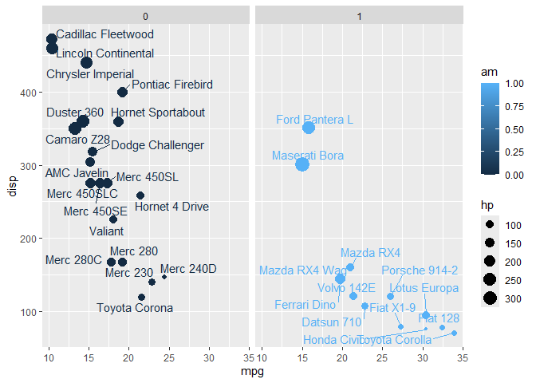
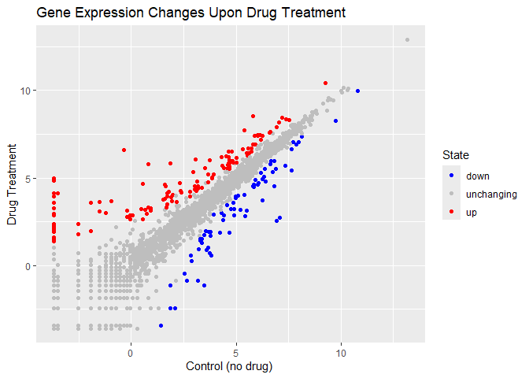

Class 5: Data Viz with ggplot
================
Medhini Sosale (PID: A69034757)

R has lots of ways to make figures and graphs in particular. One that
comes with R out of the box is called **“base” R** - the `plot()`
function.

``` r
plot(cars)
```


A very popular package in this area is called **ggplot2**

Before I can use any add-on package like this I must install it with the
`install.packages("ggplot2")` command/function.

Then to use the package I need to load it with a `library(ggplot2)`
call.

``` r
# install.packages('ggplot2')
library(ggplot2)
```

    Warning: package 'ggplot2' was built under R version 4.3.3

``` r
ggplot(cars) + 
  aes(x=speed, y=dist) + 
  geom_point()
```


For “simple” plots like this one base R code will be much shorter than
ggplot code.

Let’s fit a model and show it on my plot:

``` r
ggplot(cars) + 
  aes(x=speed, y=dist) + 
  geom_point() + 
  geom_smooth()
```

    `geom_smooth()` using method = 'loess' and formula = 'y ~ x'


Every ggplot has at least 3 layers

- **data** (data.frame with the numbers and stuff you want to plot)
- **aes**thetics (mapping of your data columns to your plot)
- **geom**s (theres are tons of these, basics are `geom_point()`,
  `geom_line()`, `geom_col()`)

``` r
head(mtcars)
```

                       mpg cyl disp  hp drat    wt  qsec vs am gear carb
    Mazda RX4         21.0   6  160 110 3.90 2.620 16.46  0  1    4    4
    Mazda RX4 Wag     21.0   6  160 110 3.90 2.875 17.02  0  1    4    4
    Datsun 710        22.8   4  108  93 3.85 2.320 18.61  1  1    4    1
    Hornet 4 Drive    21.4   6  258 110 3.08 3.215 19.44  1  0    3    1
    Hornet Sportabout 18.7   8  360 175 3.15 3.440 17.02  0  0    3    2
    Valiant           18.1   6  225 105 2.76 3.460 20.22  1  0    3    1

``` r
ggplot(mtcars) +
  aes(x=mpg, y=disp, size=hp, color=am) + 
  geom_point()
```


Now color all points blue

``` r
library(ggrepel)
```

    Warning: package 'ggrepel' was built under R version 4.3.3

``` r
ggplot(mtcars) +
  aes(x=mpg, y=disp, col=am, label=rownames(mtcars)) + 
  geom_point(aes(size=hp)) +
  facet_wrap(~am) +
  geom_text_repel()
```



In-Class Lab

``` r
url <- "https://bioboot.github.io/bimm143_S20/class-material/up_down_expression.txt"
genes <- read.delim(url)
head(genes)
```

            Gene Condition1 Condition2      State
    1      A4GNT -3.6808610 -3.4401355 unchanging
    2       AAAS  4.5479580  4.3864126 unchanging
    3      AASDH  3.7190695  3.4787276 unchanging
    4       AATF  5.0784720  5.0151916 unchanging
    5       AATK  0.4711421  0.5598642 unchanging
    6 AB015752.4 -3.6808610 -3.5921390 unchanging

``` r
nrow(genes)
```

    [1] 5196

``` r
colnames(genes)
```

    [1] "Gene"       "Condition1" "Condition2" "State"     

``` r
ncol(genes)
```

    [1] 4

``` r
table(genes$State) # using unique will tell you the names but not how many
```


          down unchanging         up 
            72       4997        127 

``` r
# making a simple ggplot
p <- ggplot(genes) + 
    aes(x=Condition1, y=Condition2, col=State) +
    geom_point()
p
```


``` r
# adding color
p + scale_colour_manual(values=c("blue","gray","red")) +
    labs(title="Gene Expression Changes Upon Drug Treatment",
         x="Control (no drug) ",
         y="Drug Treatment")
```



There are 5196 genes in this dataset.

The `table()` function is a super useful utility to determine how many
entries of each type there are.

``` r
round(table(genes$State) / nrow(genes), 3) # rounds to 3 decimal places
```


          down unchanging         up 
         0.014      0.962      0.024 

``` r
# File location online

url <- "https://raw.githubusercontent.com/jennybc/gapminder/master/inst/extdata/gapminder.tsv"

gapminder <- read.delim(url)
library(dplyr)
```

    Warning: package 'dplyr' was built under R version 4.3.3


    Attaching package: 'dplyr'

    The following objects are masked from 'package:stats':

        filter, lag

    The following objects are masked from 'package:base':

        intersect, setdiff, setequal, union

``` r
gapminder_2007 <- gapminder %>% filter(year==2007)

# basic scatter plot
library(ggplot2)
ggplot(gapminder_2007) +
  aes(x=gdpPercap, y=lifeExp) +
  geom_point()
```


``` r
# making points a bit transparent
ggplot(gapminder_2007) +
  aes(x=gdpPercap, y=lifeExp) +
  geom_point(alpha=0.5)
```


``` r
# adding aesthetic variables
ggplot(gapminder_2007) +
  aes(x=gdpPercap, y=lifeExp, color=continent, size=pop) +
  geom_point(alpha=0.5)
```


``` r
# changing aesthetics / what we color by
ggplot(gapminder_2007) + 
  aes(x = gdpPercap, y = lifeExp, color = pop) +
  geom_point(alpha=0.8)
```


``` r
# changing point size
ggplot(gapminder_2007) + 
  aes(x = gdpPercap, y = lifeExp, size = pop) +
  geom_point(alpha=0.5)
```


``` r
# scaling point size
ggplot(gapminder_2007) + 
  geom_point(aes(x = gdpPercap, y = lifeExp,
                 size = pop), alpha=0.5) + 
  scale_size_area(max_size = 10)
```


``` r
# adding 1957 data
gapminder_1957 <- gapminder %>% filter(year==1957 | year==2007)

ggplot(gapminder_1957) + 
  geom_point(aes(x = gdpPercap, y = lifeExp, color=continent,
                 size = pop), alpha=0.7) + 
  scale_size_area(max_size = 10) +
  facet_wrap(~year)
```


``` r
gapminder_top5 <- gapminder %>% 
  filter(year==2007) %>% 
  arrange(desc(pop)) %>% 
  top_n(5, pop)

gapminder_top5
```

            country continent year lifeExp        pop gdpPercap
    1         China      Asia 2007  72.961 1318683096  4959.115
    2         India      Asia 2007  64.698 1110396331  2452.210
    3 United States  Americas 2007  78.242  301139947 42951.653
    4     Indonesia      Asia 2007  70.650  223547000  3540.652
    5        Brazil  Americas 2007  72.390  190010647  9065.801

``` r
# basic bar chart
ggplot(gapminder_top5) + 
  geom_col(aes(x = country, y = pop))
```


``` r
# adding color fill
ggplot(gapminder_top5) + 
  geom_col(aes(x = country, y = pop, fill = continent))
```


``` r
# changing to a numeric variable for color
ggplot(gapminder_top5) + 
  geom_col(aes(x = country, y = pop, fill = lifeExp))
```


``` r
# changing the fill again
ggplot(gapminder_top5) +
  aes(x=country, y=pop, fill=gdpPercap) +
  geom_col()
```


``` r
# change bar order
ggplot(gapminder_top5) +
  aes(x=reorder(country, -pop), y=pop, fill=gdpPercap) +
  geom_col()
```


``` r
# fill by country
ggplot(gapminder_top5) +
  aes(x=reorder(country, -pop), y=pop, fill=country) +
  geom_col(col="gray30") +
  guides(fill="none")
```


``` r
head(USArrests)
```

               Murder Assault UrbanPop Rape
    Alabama      13.2     236       58 21.2
    Alaska       10.0     263       48 44.5
    Arizona       8.1     294       80 31.0
    Arkansas      8.8     190       50 19.5
    California    9.0     276       91 40.6
    Colorado      7.9     204       78 38.7

``` r
USArrests$State <- rownames(USArrests)
ggplot(USArrests) +
  aes(x=reorder(State,Murder), y=Murder) +
  geom_col() +
  coord_flip()
```


``` r
ggplot(USArrests) +
  aes(x=reorder(State,Murder), y=Murder) +
  geom_point() +
  geom_segment(aes(x=State, 
                   xend=State, 
                   y=0, 
                   yend=Murder), color="blue") +
  coord_flip()
```


``` r
library(patchwork)
```

    Warning: package 'patchwork' was built under R version 4.3.3

``` r
# Setup some example plots 
p1 <- ggplot(mtcars) + geom_point(aes(mpg, disp))
p2 <- ggplot(mtcars) + geom_boxplot(aes(gear, disp, group = gear))
p3 <- ggplot(mtcars) + geom_smooth(aes(disp, qsec))
p4 <- ggplot(mtcars) + geom_bar(aes(carb))

# Use patchwork to combine them here:
(p1 | p2 | p3) /
      p4
```

    `geom_smooth()` using method = 'loess' and formula = 'y ~ x'


``` r
ggplot(mtcars) +
  aes(mpg, disp) + 
  geom_point()
```


``` r
ggsave('myplot.pdf')
```

    Saving 7 x 5 in image
