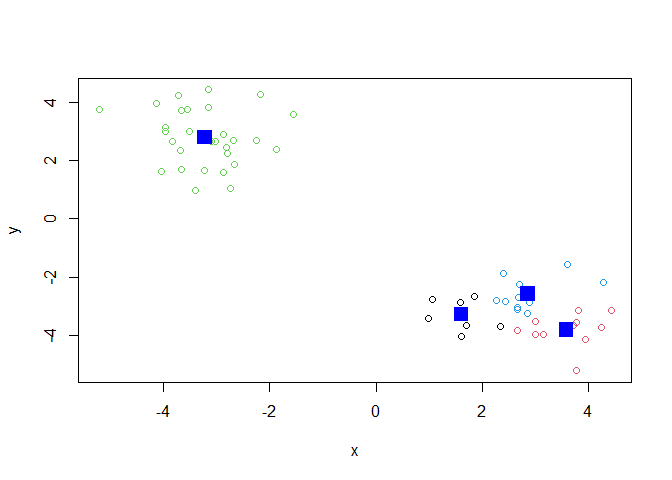

Class 7: Machine Learning 1
================
Medhini Sosale (PID: A69034757)

Before we get into clustering methods let’s make some sample data to
cluster where we know what the answer should be.

To help with this I will use the `rnorm()` function.

``` r
hist(rnorm(150000, mean = c(-3,3)))
```


``` r
n=10000
hist(c(rnorm(n, mean=-3), rnorm(n, mean=3)))
```


``` r
n=30
x <- c(rnorm(n, mean=3), rnorm(n, mean=-3))
y <- rev(x)
z <- cbind(x,y)
plot(z)
```


## K-means clustering

The function in base R for k-means clustering is called `kmeans()`.

``` r
km <- kmeans(z, centers = 2)
km
```

    K-means clustering with 2 clusters of sizes 30, 30

    Cluster means:
              x         y
    1  2.788317 -3.215690
    2 -3.215690  2.788317

    Clustering vector:
     [1] 1 1 1 1 1 1 1 1 1 1 1 1 1 1 1 1 1 1 1 1 1 1 1 1 1 1 1 1 1 1 2 2 2 2 2 2 2 2
    [39] 2 2 2 2 2 2 2 2 2 2 2 2 2 2 2 2 2 2 2 2 2 2

    Within cluster sum of squares by cluster:
    [1] 42.24747 42.24747
     (between_SS / total_SS =  92.8 %)

    Available components:

    [1] "cluster"      "centers"      "totss"        "withinss"     "tot.withinss"
    [6] "betweenss"    "size"         "iter"         "ifault"      

``` r
km$centers
```

              x         y
    1  2.788317 -3.215690
    2 -3.215690  2.788317

> Q. Print out the cluster membership vector (i.e. our main answer)

``` r
km$cluster
```

     [1] 1 1 1 1 1 1 1 1 1 1 1 1 1 1 1 1 1 1 1 1 1 1 1 1 1 1 1 1 1 1 2 2 2 2 2 2 2 2
    [39] 2 2 2 2 2 2 2 2 2 2 2 2 2 2 2 2 2 2 2 2 2 2

Plot with clustering result and add cluster centers:

``` r
plot(z, col=km$cluster)
points(km$centers, col="blue", pch=15, cex=2)
```


> Q. Can you cluster our data in `z` into four clusters please?

``` r
km_4 <- kmeans(z, centers = 4)
plot(z, col=km_4$cluster)
points(km_4$centers, col="blue", pch=15, cex=2)
```



## Hierarchical Clustering

The main function for hierarchical clustering in base R is called
`hclust()`

Unlike `kmeans()` I cannot just pass in my data as input I first need a
distance matrix from my data.

``` r
d <- dist(z)
hc <- hclust(d)
hc
```


    Call:
    hclust(d = d)

    Cluster method   : complete 
    Distance         : euclidean 
    Number of objects: 60 

There is a specific hclust plot() method…

``` r
plot(hc)
abline(h=10, col='red')
```


To get my main clustering result (i.e. the membership vector) I can
“cut” my tree at a given height. To do this I will use the `cutree()`
function

``` r
grps <- cutree(hc, h=10)
grps
```

     [1] 1 1 1 1 1 1 1 1 1 1 1 1 1 1 1 1 1 1 1 1 1 1 1 1 1 1 1 1 1 1 2 2 2 2 2 2 2 2
    [39] 2 2 2 2 2 2 2 2 2 2 2 2 2 2 2 2 2 2 2 2 2 2

``` r
plot(z, col=grps)
```


## Principal Component Analysis

PCA is a multivariate statistical technique for reducing data set
dimensionality.

## PCA of UK food data

``` r
url <- "https://tinyurl.com/UK-foods"
x <- read.csv(url)
dim(x)
```

    [1] 17  5

``` r
head(x)
```

                   X England Wales Scotland N.Ireland
    1         Cheese     105   103      103        66
    2  Carcass_meat      245   227      242       267
    3    Other_meat      685   803      750       586
    4           Fish     147   160      122        93
    5 Fats_and_oils      193   235      184       209
    6         Sugars     156   175      147       139

``` r
rownames(x) <- x[,1]
x <- x[,-1]
head(x)
```

                   England Wales Scotland N.Ireland
    Cheese             105   103      103        66
    Carcass_meat       245   227      242       267
    Other_meat         685   803      750       586
    Fish               147   160      122        93
    Fats_and_oils      193   235      184       209
    Sugars             156   175      147       139

``` r
dim(x)
```

    [1] 17  4

Q1. There are 17 rows and 5 columns. You can find this out by using
nrow() and ncol() together or just dim().

``` r
x <- read.csv(url, row.names=1)
head(x)
```

                   England Wales Scotland N.Ireland
    Cheese             105   103      103        66
    Carcass_meat       245   227      242       267
    Other_meat         685   803      750       586
    Fish               147   160      122        93
    Fats_and_oils      193   235      184       209
    Sugars             156   175      147       139

Q2. I like the second approach better because it’s more concise and
because if you run the first approach multiple times you’ll just keep
deleting columns.

``` r
barplot(as.matrix(x), beside=F, col=rainbow(nrow(x)))
```


Q3. I changed beside=T to beside=F.

``` r
pairs(x, col=rainbow(10), pch=16)
```


Q5. The code above plots each pair of countries against each other and
color codes the food types. You can determine which countries are being
compared based on the row/column that each subplot is in. If a point
lies on the diagonal, then both countries consume a roughly equal amount
of food in that category.

## PCA to the rescue

The main function to do PCA in base R is called `prcomp()`.

Note that I need to take the transpose of this particular data as that
is what the `prcomp()` help page was asking for.

``` r
pca <- prcomp( t(x) )
summary(pca)
```

    Importance of components:
                                PC1      PC2      PC3       PC4
    Standard deviation     324.1502 212.7478 73.87622 3.176e-14
    Proportion of Variance   0.6744   0.2905  0.03503 0.000e+00
    Cumulative Proportion    0.6744   0.9650  1.00000 1.000e+00

Let’s see what is inside our result object `pca` that we just
calculated:

``` r
attributes(pca)
```

    $names
    [1] "sdev"     "rotation" "center"   "scale"    "x"       

    $class
    [1] "prcomp"

``` r
pca$x
```

                     PC1         PC2        PC3           PC4
    England   -144.99315   -2.532999 105.768945 -4.894696e-14
    Wales     -240.52915 -224.646925 -56.475555  5.700024e-13
    Scotland   -91.86934  286.081786 -44.415495 -7.460785e-13
    N.Ireland  477.39164  -58.901862  -4.877895  2.321303e-13

To make our main result figure, called a “PC plot” (or “score plot”,
“ordination plot” or PC1 vs PC2 plot)

``` r
plot(pca$x[,1], pca$x[,2], col=c("black", "red", "blue", "darkgreen"), 
     pch=16, xlab='PC1 (67.4%)', ylab=('PC2 (29%)'))
```


## Variable loadings plot

Can give us insight on how the original variables (in this case the
foods) contribute to our new PC axis

``` r
par(mar=c(10, 3, 0.35, 0))
barplot( pca$rotation[,1], las=2 )
```


``` r
# Scotland
par(mar=c(10, 3, 0.35, 0))
barplot( pca$rotation[,2], las=2 )
```


